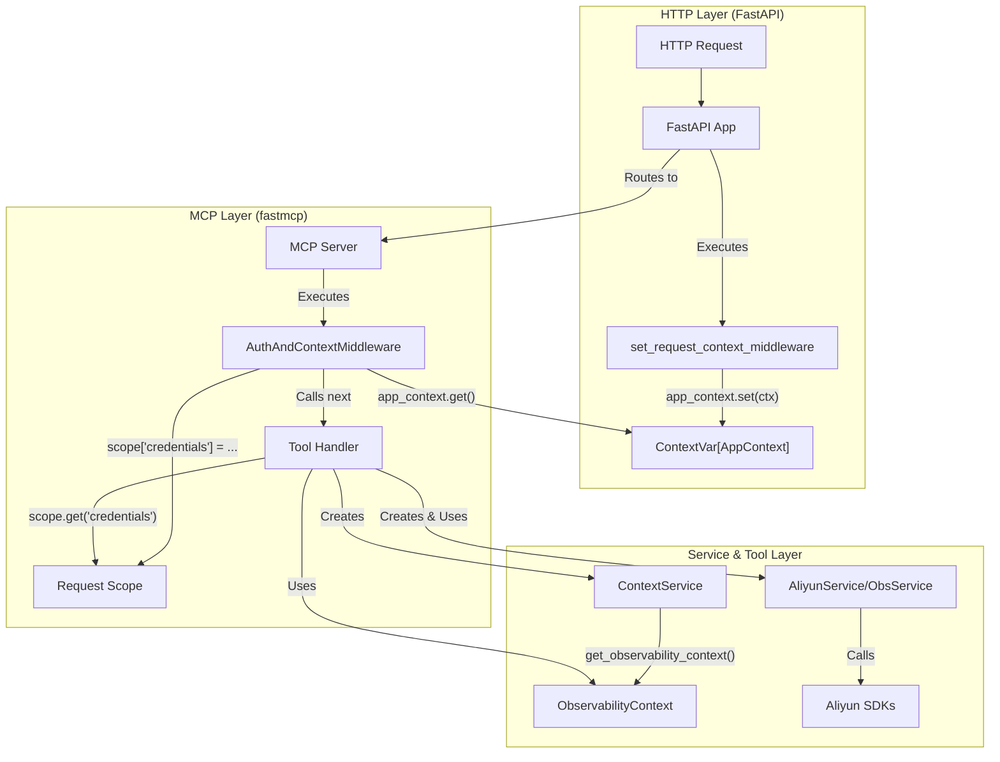

# Python MCP Server - 架构设计文档

## 1. 概述

本文档为基于 `fastmcp` 库重构的 Python MCP Server 提供一个清晰、可扩展且优雅的架构设计。

本次重构的核心目标是，在借鉴现有 Go 版本优秀分层思想的基础上，利用 `fastmcp` 和 `FastAPI` 的原生特性，构建一个职责分明、高度解耦、易于扩展的 Python 应用。

## 2. 核心原则

- **分层架构**: 严格划分表示层、工具层、服务层和配置层，确保关注点分离。
- **原生依赖注入**: 充分利用 `fastmcp` 的上下文状态管理 (`State`) 和 `FastAPI` 的依赖注入 (`Depends`) 机制，实现认证与业务的完全解耦。
- **高扩展性**: 设计可插拔的工具和认证机制，未来接入新的工具（如腾讯云、其他SaaS服务）或新的认证方式时，对现有代码的侵入性降至最低。

## 3. 推荐项目目录结构

```
.
├── app/
│   ├── __init__.py
│   ├── main.py                     # FastAPI 应用入口，挂载 MCP Server
│   ├── config.py                   # Pydantic 配置模型
│   ├── context.py                  # 定义 ContextVar 用于存储请求对象
│   ├── models.py                   # Pydantic 数据模型
│   ├── middleware/
│   │   ├── __init__.py
│   │   ├── auth.py                 # 核心：fastmcp 认证中间件
│   │   └── context_injection.py    # 将凭证注入服务上下文的中间件
│   ├── services/
│   │   ├── __init__.py
│   │   ├── base.py                 # 服务基类
│   │   ├── aliyun_service.py       # 封装阿里云 ACK SDK 交互
│   │   ├── kubectl_service.py      # 封装 kubectl 命令执行
│   │   └── observability_service.py # 封装阿里云可观测性服务 (SLS, ARMS) 交互
│   └── tools/
│       ├── __init__.py
│       ├── registry.py             # 统一注册所有 Tools
│       ├── aliyun_tools.py         # 阿里云 ACK 相关 Tools
│       ├── kubectl_tools.py        # Kubectl 相关 Tools
│       └── observability_tools.py  # 可观测性相关 Tools
├── pyproject.toml
├── uv.lock
└── README.md
```

## 4. 关键挑战与解决方案：HTTP Header 注入

Go 版本的 `HTTPContextFunc` 允许直接访问 HTTP 请求。在 `fastmcp` 中，我们通过一个巧妙的“双层中间件”模式来优雅地实现这一目标。

1.  **`app/context.py`**: 定义一个全局的 `ContextVar` 来存储 `AppContext`。
    ```python
    # app/context.py
    from contextvars import ContextVar
    from typing import Optional
    from pydantic import BaseModel
    from starlette.requests import Request

    class AppContext(BaseModel):
        request: Optional[Request] = None
        # ... 未来可以添加更多上下文信息

        class Config:
            arbitrary_types_allowed = True

    app_context: ContextVar[AppContext] = ContextVar("app_context")
    ```

2.  **`app/main.py`**: 在 FastAPI 应用中，添加一个 ASGI 中间件来捕获请求并设置上下文。
    ```python
    # app/main.py (部分代码)
    @app.middleware("http")
    async def set_request_context_middleware(request: Request, call_next):
        ctx = AppContext(request=request)
        app_context.set(ctx)
        response = await call_next(request)
        return response
    ```
    这个中间件的唯一作用就是在请求处理期间，将 `Request` 对象存入我们自定义的 `AppContext` 中。

3.  **`app/middleware/auth.py`**: 这是我们的核心 `fastmcp` 认证中间件。
    ```python
    # app/middleware/auth.py (伪代码)
    class AuthAndContextMiddleware(Middleware):
        async def on_request(self, context: MiddlewareContext, call_next):
            # 1. 从 ContextVar 读取 AppContext
            ctx = app_context.get()
            if not ctx or not ctx.request:
                raise McpError(...) # 如果没有请求上下文，则出错

            # 2. 执行 Bearer Token 认证
            auth_header = ctx.request.headers.get("Authorization")
            # ... 校验逻辑 ...

            # 3. 提取阿里云凭证
            credentials = {
                "ak_id": ctx.request.headers.get("X-Aliyun-Access-Key-Id"),
                "ak_secret": ctx.request.headers.get("X-Aliyun-Access-Key-Secret"),
                # ... 其他凭证 ...
            }

            # 4. 将凭证存入请求 scope，供后续使用
            # 这是关键一步，将 HTTP 层的凭证传递给工具层
            context.request.scope["credentials"] = credentials

            # 5. 继续执行
            return await call_next(context)
    ```
    这个流程清晰、稳健，且完美地将 HTTP 层的细节与 MCP 协议层的逻辑解耦。工具函数现在可以从请求 `scope` 中安全地获取凭证。

## 5. 数据流与架构图



## 6. 如何扩展

### 添加一个新的 Tool Provider (例如：腾讯云)

1.  **`app/services/tencent_service.py`**: 创建新的服务类，封装与腾讯云 SDK 的交互。
2.  **`app/dependencies/services.py`**: 添加 `get_tencent_service` 依赖注入函数。
3.  **`app/middleware/auth.py`**: 在 `on_request` 中添加提取腾讯云凭证（如 `X-Tencent-*` headers）并 `set_state` 的逻辑。
4.  **`app/tools/tencent_tools.py`**: 创建新的工具文件，工具函数通过 `Depends(get_tencent_service)` 使用服务。
5.  **`app/tools/registry.py`**: 注册新的腾讯云工具。

整个过程无需修改任何现有工具或核心逻辑，实现了真正的可插拔式扩展。
